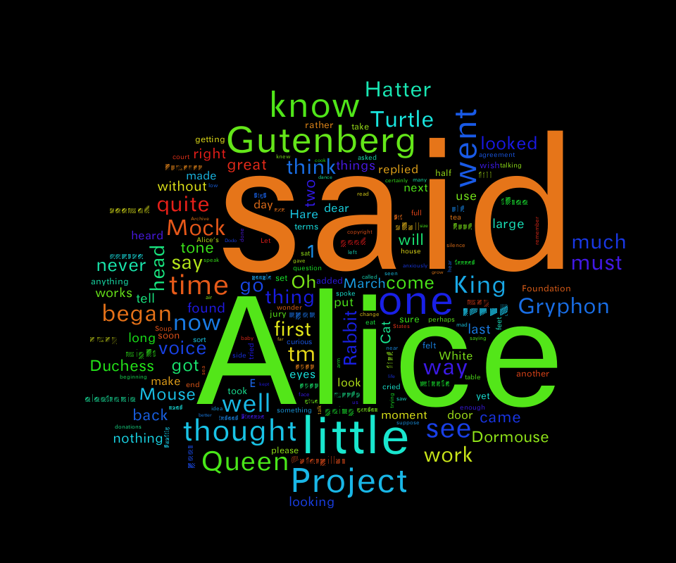

easy_word_cloud
==========
##features
Based on [word_cloud] and [word cloud generate], I created this easy word cloud. 
1. easy to use. compare to word cloud, easy_word_cloud provide a simplier interface.
2. more effcient. compare to word_cloud, easy_word_cloud is more effcient with bigger canvas.
3. custom weight. for each word, the user can provide a weight( a weight can be the count of that word, or the percentage and so on ). the weight must greate than zeros. and there are no other constraint. so you can scale the weight to log scale 
you can provide log(count) as a weight.
4. font size is liner with weight. In order to provide a more reasonable figure, the weight is liner with the font size. 
5. smart draw. to choice font size smart with regard to the size of word, weight of word, size of the canvas. 

## Installation

Fast install:

    sudo pip install git+git://github.com/knightwu/easy_word_cloud.git

Otherwise, get this package:
    
    wget https://github.com/knightwu/easy_word_cloud/archive/master.zip
    unzip master.zip
    rm master.zip
    cd easy_word_cloud-master

Install the requirements:

    sudo pip install -r requirements.txt

Install the package:

    sudo python setup.py install

##How to draw a word cloud
1. prepare the material. a list of word tuples.
```python
words = [('hello', 3), ('world', 5)]
```
or
```python
words = [('hello', math.log(3)), ('world', math.log(5))]
```
2. prepare the fonts and then call the function.
English:
```python
words = [('hello', 3), ('world', 5)]
```
Chinese:
```python
words = [('你好', 3), ('吗', 5)]
```
```python
words = [('ひらがな', 3), ('Hiragana', 5)， ('히라가나', 5)]
```


## Examples
Note that if you are not on mac, you need to adjust FONT_PATH to point to
some existing font.

Check out [examples/simple.py][simple] for a short intro. A sample output is:


Or run [examples/more.py][more] to see more options. A sample output is:



## Used in

### [other]

*Send a pull request to add yours here.*

## Issues

Using Pillow instead of PIL might might get you the [`TypeError: 'int' object is
not iterable` problem][intprob] also showcased on the blog.

[blog-post]: http://peekaboo-vision.blogspot.de/2012/11/a-wordcloud-in-python.html
[simple]: examples/simple.py
[more]: examples/more.py
[reddit-cloud]: https://github.com/amueller/reddit-cloud
[wc2]: http://www.reddit.com/user/WordCloudBot2
[wc2top]: http://www.reddit.com/user/WordCloudBot2/?sort=top
[intprob]: http://peekaboo-vision.blogspot.de/2012/11/a-wordcloud-in-python.html#bc_0_28B


todo:
1.unicode support
2.python 3 support
3.

